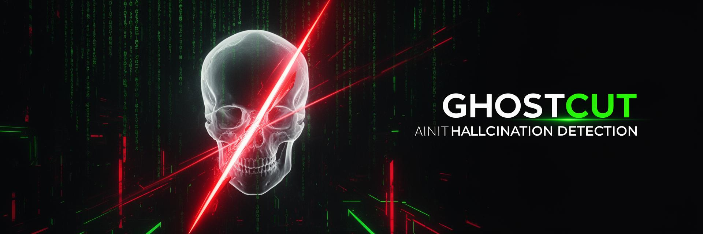

<p align="center">
  
</p>

<p align="center">
  
</p>

<h1 align="center">🔪 GHOSTCUT — Forensic Audit</h1>

<h3 align="center">
  <code>Cutting Hallucinations Out of AI</code>
</h3>

<p align="center">
  <strong>An enterprise-grade verification layer that forensically audits AI-generated content against source documents — claim by claim, sentence by sentence.</strong>
</p>

<br/>

<p align="center">
  <a href="https://sriramdama.in"></a>
  &nbsp;
  
  &nbsp;
  
</p>

<p align="center">
  
  
  
  
  
  
  
  
</p>

---

<br/>

## 🧠 The Core Idea

```
LLMs are smart.          → They generate fluent, confident text.
LLMs are confident.      → They never say "I don't know."
LLMs are also wrong.     → They hallucinate facts, silently.
```

**GHOSTCUT** doesn't generate text. It **dissects** AI output like a forensic examiner — extracting every factual claim, cross-referencing it against your documents, and delivering a verdict with evidence.

> 🔍 _"A forensic lie detector for AI outputs."_

<br/>

---

<br/>

## ❌ Why This Matters

<table>
<tr>
<td width="50%">

### 🚨 The AI Trust Crisis

```diff
- LLMs hallucinate 3-27% of generated facts
- Hallucinations are often subtle & plausible
- No built-in source traceability
- Dangerous in healthcare, law & finance
```

</td>
<td width="50%">

### 🐌 Manual Verification Fails

```diff
- Slow: Hours per document
- Expensive: $50-200/hr expert review
- Doesn't scale: 1 human = 1 document
- Inconsistent: Human fatigue & bias
```

</td>
</tr>
</table>

> 👉 **The bottleneck for enterprise AI adoption isn't capability — it's trust.**

<br/>

---

<br/>

## ✅ The Solution

GHOSTCUT inserts a **forensic verification layer** between AI outputs and human decisions.

<table>
<tr>
<td align="center" width="20%">
<h3>🔬</h3>
<strong>DECOMPOSE</strong><br/>
<sub>Break AI text into atomic factual claims</sub>
</td>
<td align="center" width="20%">
<h3>📄</h3>
<strong>RETRIEVE</strong><br/>
<sub>Find relevant evidence from uploaded docs only</sub>
</td>
<td align="center" width="20%">
<h3>⚖️</h3>
<strong>VERIFY</strong><br/>
<sub>NLI classification: supported, contradicted, or unverifiable</sub>
</td>
<td align="center" width="20%">
<h3>🧠</h3>
<strong>EXPLAIN</strong><br/>
<sub>Human-readable reasoning with exact source quotes</sub>
</td>
<td align="center" width="20%">
<h3>📊</h3>
<strong>SCORE</strong><br/>
<sub>Math-based Trust Score with risk classification</sub>
</td>
</tr>
</table>

### Verdict System

| Verdict | Meaning | Visual |
|---------|---------|--------|
| **SUPPORTED** | Claim is backed by document evidence | 🟢 Green |
| **CONTRADICTED** | Claim conflicts with source material | 🔴 Red |
| **UNVERIFIABLE** | No direct evidence found in documents | 🟡 Amber |

```
✅ Document-bounded — no internet guessing
✅ Zero hallucination amplification
✅ Every verdict is explainable & auditable
```

<br/>

---

<br/>

## ⚙️ System Architecture

```
┌─────────────────────────────────────────────────────────────────────────┐
│                         GHOSTCUT PIPELINE                              │
│                                                                         │
│  ┌──────────┐    ┌──────────────┐    ┌───────────────┐                 │
│  │  USER     │    │  DOCUMENT    │    │  AI-GENERATED │                 │
│  │  UPLOAD   │───▶│  PROCESSOR   │    │  TEXT INPUT   │                 │
│  └──────────┘    └──────┬───────┘    └───────┬───────┘                 │
│                         │                     │                         │
│                         ▼                     ▼                         │
│              ┌──────────────────┐   ┌──────────────────┐               │
│              │  CHUNK ENGINE    │   │  CLAIM DECOMPOSER│               │
│              │  300-500 tokens  │   │  (Gemini AI)     │               │
│              │  per block       │   │  Atomic claims   │               │
│              └────────┬─────────┘   └────────┬─────────┘               │
│                       │                       │                         │
│                       ▼                       ▼                         │
│              ┌────────────────────────────────────────┐                 │
│              │     SEMANTIC RETRIEVAL ENGINE          │                 │
│              │                                        │                 │
│              │  ┌─────────┐  ┌─────────┐             │                 │
│              │  │ TF-IDF  │  │  SBERT  │             │                 │
│              │  │ Fast    │  │ Semantic│             │                 │
│              │  │ Filter  │──│ Match   │             │                 │
│              │  └─────────┘  └────┬────┘             │                 │
│              └────────────────────┼──────────────────┘                 │
│                                   │                                     │
│                                   ▼                                     │
│              ┌────────────────────────────────────────┐                 │
│              │     NLI VERIFICATION ENGINE            │                 │
│              │                                        │                 │
│              │  Claim + Evidence ──▶ Entailment?      │                 │
│              │                  ──▶ Contradiction?    │                 │
│              │                  ──▶ Neutral?          │                 │
│              │                                        │                 │
│              │  Models: RoBERTa / DeBERTa             │                 │
│              └────────────────────┬───────────────────┘                 │
│                                   │                                     │
│                     ┌─────────────┼─────────────┐                      │
│                     ▼             ▼             ▼                       │
│              ┌───────────┐ ┌───────────┐ ┌───────────┐                 │
│              │ EXPLAIN   │ │  TRUST    │ │  RISK     │                 │
│              │ ENGINE    │ │  SCORE    │ │  CLASSIFY │                 │
│              │           │ │  0-100    │ │  L/M/H    │                 │
│              └───────────┘ └───────────┘ └───────────┘                 │
│                                                                         │
└─────────────────────────────────────────────────────────────────────────┘
```

<br/>

---

<br/>

## 🧩 Tech Stack Deep Dive

### 🤖 AI & NLP Layer

<table>
<tr>
<td width="25%" align="center">
<h4>Sentence-BERT</h4>
<sub><strong>Semantic Retrieval</strong></sub>
<br/><br/>
Encodes document chunks and claims into dense vector embeddings. Finds semantically relevant evidence even when wording differs completely from the claim.
</td>
<td width="25%" align="center">
<h4>TF-IDF</h4>
<sub><strong>Fast Filtering</strong></sub>
<br/><br/>
Classical NLP first-pass filter. Rapidly narrows thousands of chunks to top candidates using term frequency — before expensive semantic matching kicks in.
</td>
<td width="25%" align="center">
<h4>RoBERTa / DeBERTa</h4>
<sub><strong>NLI Classification</strong></sub>
<br/><br/>
Natural Language Inference models trained on entailment datasets. Determines whether evidence <em>supports</em>, <em>contradicts</em>, or is <em>neutral</em> to each claim.
</td>
<td width="25%" align="center">
<h4>Gemini 2.5 Flash</h4>
<sub><strong>Claim Decomposition</strong></sub>
<br/><br/>
Intelligently breaks complex AI-generated paragraphs into atomic, independently verifiable factual claims. Also provides judicial reasoning for verdicts.
</td>
</tr>
</table>

> ⚠️ **Critical Design Choice:** No large generative models are used for the actual verification step. Verification is handled by deterministic NLI classifiers — not by another LLM that could hallucinate.

### 🏗️ Frontend & Infrastructure

<table>
<tr>
<td width="33%">

#### ⚡ Core Stack
| Tech | Role |
|------|------|
| **React 18** | Component-based UI |
| **TypeScript** | Full type safety |
| **Vite** | Sub-second HMR |
| **Tailwind CSS** | Utility-first styling |

</td>
<td width="33%">

#### 🎨 UI & Visualization
| Tech | Role |
|------|------|
| **shadcn/ui** | Accessible components |
| **Recharts** | Trust score charts |
| **Lucide Icons** | Consistent iconography |
| **Framer Motion** | Fluid animations |

</td>
<td width="33%">

#### ☁️ Backend & AI
| Tech | Role |
|------|------|
| **Supabase** | Auth + Edge Functions |
| **Gemini AI** | Claim decomposition |
| **Edge Functions** | Serverless verification |
| **PostgreSQL** | Audit history storage |

</td>
</tr>
</table>

<br/>

---

<br/>

## 📊 Feature Showcase

<table>
<tr>
<td width="50%">

### 🎯 Claim-Level Forensics
Every sentence is decomposed into atomic claims. Each claim gets its own verdict, confidence score, evidence trail, and human-readable explanation — visible inline without any clicks.

### 📉 Trust Score Engine
```
Score = 100 − (Contradicted% × 1.5) − (Unverifiable% × 0.5)
```
Mathematically defensible. No vibes. No guessing.

### ⚠️ Smart Risk Classification
| Level | Trigger |
|-------|---------|
| 🟢 LOW | Contradicted < 10% |
| 🟡 MEDIUM | Contradicted 10%–29% |
| 🔴 HIGH | Critical contradiction OR ≥ 30% |

</td>
<td width="50%">

### 🧠 Cascade Hallucination Detection
If Claim A is contradicted and Claim B depends on A, both are flagged. Logical dependency chains are traced and visualized.

### 📤 Multi-Format Export
Export forensic reports in **4 formats**:
- 📕 **PDF** — Professional audit report
- 📋 **JSON** — Machine-readable structured data
- 📊 **CSV** — Spreadsheet-compatible
- 📝 **Markdown** — Documentation-ready

### ⚙️ Configurable Engine
- Verification depth (Shallow → Forensic)
- Confidence thresholds (30%–100%)
- Chunk size tuning (128–2048 tokens)
- Strict mode (unverifiable = contradicted)

</td>
</tr>
</table>

<br/>

---

<br/>

## 🔒 Design Principles

```
┌─────────────────────────────────────────────────────────────┐
│                                                             │
│   1. DOCUMENT-BOUNDED                                       │
│      → Never searches the internet                          │
│      → Only verifies against YOUR uploaded documents        │
│      → Zero hallucination amplification                     │
│                                                             │
│   2. DETERMINISTIC VERIFICATION                             │
│      → NLI classifiers, not generative models               │
│      → Same input = Same output, every time                 │
│      → Auditable and reproducible                           │
│                                                             │
│   3. EXPLAINABLE BY DEFAULT                                 │
│      → Every verdict shows WHY                              │
│      → Exact source passages quoted                         │
│      → Confidence scores are transparent                    │
│                                                             │
│   4. ZERO-TRUST ARCHITECTURE                                │
│      → Every claim verified independently                   │
│      → No claim inherits trust from neighbors               │
│      → Cascade detection catches dependency chains          │
│                                                             │
└─────────────────────────────────────────────────────────────┘
```

<br/>

---

<br/>

## 💼 Real-World Applications

<table>
<tr>
<td align="center" width="20%">
<h3>🏥</h3>
<strong>Healthcare</strong><br/>
<sub>Audit AI-generated clinical summaries, drug interaction reports, and patient documentation against medical literature.</sub>
</td>
<td align="center" width="20%">
<h3>⚖️</h3>
<strong>Legal</strong><br/>
<sub>Verify AI contract analysis, case law citations, and compliance reports against source legal documents.</sub>
</td>
<td align="center" width="20%">
<h3>💰</h3>
<strong>Finance</strong><br/>
<sub>Cross-check AI financial reports, risk assessments, and regulatory filings against authoritative data.</sub>
</td>
<td align="center" width="20%">
<h3>🤖</h3>
<strong>AI Copilots</strong><br/>
<sub>Add guardrails to any AI assistant — verify outputs before they reach end users in production.</sub>
</td>
<td align="center" width="20%">
<h3>🏢</h3>
<strong>Enterprise</strong><br/>
<sub>Trust layer for any LLM deployment — from internal knowledge bases to customer-facing AI systems.</sub>
</td>
</tr>
</table>

> **If AI is used in high-stakes decisions, GHOSTCUT belongs in the pipeline.**

<br/>

---

<br/>

## 💰 Business Model

<table>
<tr>
<td width="50%">

### Revenue Streams
| Channel | Model |
|---------|-------|
| 💳 **SaaS** | Monthly/annual subscriptions |
| 🔌 **API** | Pay-per-verification usage |
| 🏢 **Enterprise** | Custom licensing + on-prem |
| 💬 **Integrations** | WhatsApp, Slack, Teams add-ons |

</td>
<td width="50%">

### Why It Scales
```diff
+ Low compute cost (no GPT-scale inference)
+ High trust value (compliance & risk reduction)  
+ Easy API integration into existing AI pipelines
+ Modular architecture — swap models freely
+ Every enterprise using LLMs is a potential customer
```

</td>
</tr>
</table>

<br/>

---

<br/>

## 🚀 Quick Start

```bash
# 1. Clone
git clone https://github.com/your-repo/ghostcut.git
cd ghostcut

# 2. Install
npm install

# 3. Launch
npm run dev
```

```
🌐 Open http://localhost:5173
📄 Upload a source document (PDF, TXT, DOCX)
📝 Paste AI-generated text
🔪 Hit "Run Audit" — watch hallucinations get CUT
```

<br/>

---

<br/>

## 🌐 Try It Live

<p align="center">
  <a href="https://sriramdama.in">
    
  </a>
</p>

<p align="center">
  <strong>Upload a document</strong> → <strong>Paste AI output</strong> → <strong>Watch hallucinations get cut</strong> 🔪
</p>

<br/>

---

<br/>

## 🏁 The Bottom Line

```
┌──────────────────────────────────────────────┐
│                                              │
│   AI is powerful.                            │
│   AI is fast.                                │
│   But AI without verification               │
│   is a liability.                            │
│                                              │
│   GHOSTCUT makes AI trustworthy.             │
│                                              │
└──────────────────────────────────────────────┘
```

> **_"If AI writes the future, GHOSTCUT verifies it."_**

<br/>

---

<p align="center">
  
  &nbsp;
  
  &nbsp;
  
</p>

<h3 align="center">— Team AVENGERS 🛡️</h3>

<p align="center">
  <sub>🏆 Built for IIT Roorkee E-Summit Hackathon 2025</sub>
</p>

<p align="center">
  <sub>Made with ❤️ and zero hallucinations</sub>
</p>


